# Exercise 2: Ingest data with a pipeline in Microsoft Fabric

### Estimated Duration: 90 minutes

A data lakehouse is a common analytical data store for cloud-scale analytics solutions. One of the core tasks of a data engineer is to implement and manage the ingestion of data from multiple operational data sources into the lakehouse. In Microsoft Fabric, you can implement *extract, transform, and load* (ETL) or *extract, load, and transform* (ELT) solutions for data ingestion through the creation of *pipelines*.

Fabric also supports Apache Spark, enabling you to write and run code to process data at scale. By combining the pipeline and Spark capabilities in Fabric, you can implement complex data ingestion logic that copies data from external sources into the OneLake storage on which the lakehouse is based and then uses Spark code to perform custom data transformations before loading it into tables for analysis.

## Lab objectives

You will be able to complete the following tasks:

- Task 1: Create a Lakehouse
- Task 2: Explore shortcuts
- Task 3: Create a pipeline
- Task 4: Create a notebook
- Task 5: Use SQL to query tables
- Task 6: Create a visual query
- Task 7: Create a report
- Task 8: Analyze report using Fabric Copilot
  
### Task 1: Create a Lakehouse

Large-scale data analytics solutions have traditionally been built around a *data warehouse*, in which data is stored in relational tables and queried using SQL. The growth in "big data" (characterized by high *volumes*, *variety*, and *velocity* of new data assets) together with the availability of low-cost storage and cloud-scale distributed computing technologies has led to an alternative approach to analytical data storage; the *data lake*. In a data lake, data is stored as files without imposing a fixed schema for storage. Increasingly, data engineers and analysts seek to benefit from the best features of both of these approaches by combining them in a *data lakehouse*; in which data is stored in files in a data lake and a relational schema is applied to them as a metadata layer so that they can be queried using traditional SQL semantics.

In Microsoft Fabric, a lakehouse provides highly scalable file storage in a *OneLake* store (built on Azure Data Lake Store Gen2) with a metastore for relational objects such as tables and views based on the open source *Delta Lake* table format. Delta Lake enables you to define a schema of tables in your lakehouse that you can query using SQL.

Now that you have created a workspace in the previous step, it's time to switch to the *Data engineering* experience in the portal and create a data lakehouse into which you will ingest data.

1. At the bottom left of the Power BI portal, select the **Power BI (1)** icon and switch to the **Data Engineering (2)** experience.

   
   
1. In the **Data engineering** home page, click on **Lakehouse** to create a new lakehouse.

   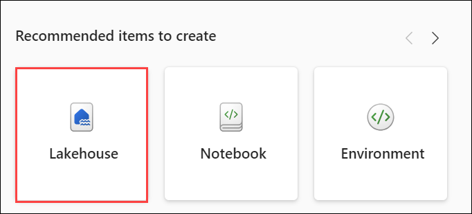

1. On the **New lakehouse**, enter the following:

    - **Name:** Enter **Lakehouse_<inject key="DeploymentID" enableCopy="false"/> (1)**

    - Click on **Create (2)**.

      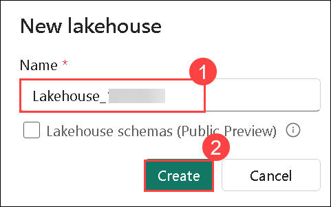

      >**Note:** After a minute or so, a new lakehouse with no **Tables** or **Files** will be created.

1. On the **Lakehouse_<inject key="DeploymentID" enableCopy="false"/>** tab in the pane on the left, in the `...` menu for the **Files (1)** node, select **New subfolder (2)**.

   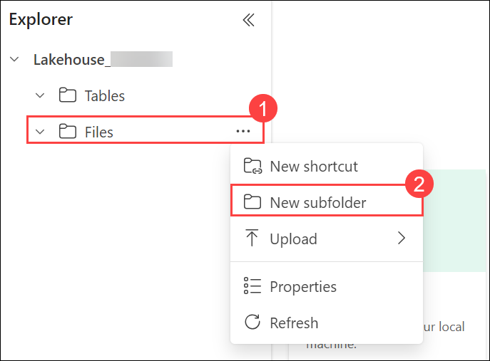

1. Create a subfolder named **new_data (1)** and click on **Create (2)**.

   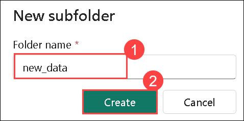

### Task 2: Explore shortcuts

In many scenarios, the data you need to work within your lakehouse may be stored in some other location. While there are many ways to ingest data into the OneLake storage for your lakehouse, another option is to instead create a *shortcut*. Shortcuts enable you to include externally sourced data in your analytics solution without the overhead and risk of data inconsistency associated with copying it.

1. In the `...` **(1)** menu for the **Files** folder, select **New shortcut (2)**.

   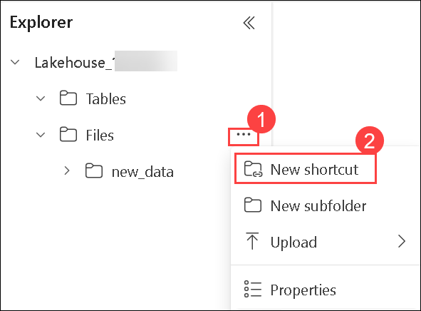

1. View the available data source types for shortcuts. Then close the **New shortcut** dialog box without creating a shortcut.

   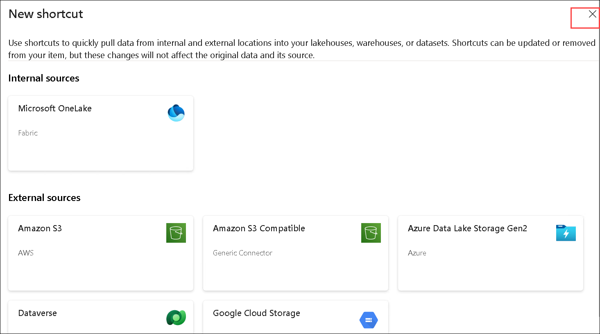

### Task 3: Create a pipeline

A simple way to ingest data is to use a **Copy data** activity in a pipeline to extract the data from a source and copy it to a file in the lakehouse.

1. On the **Home** page for your lakehouse, select **New data pipeline**.

    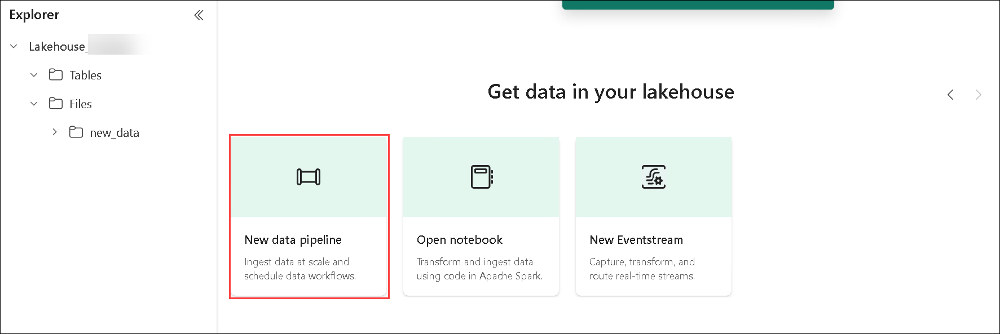

1. Create a new data pipeline named **Ingest Sales Data Pipeline (1)** and click on **Create (2)**. 
   
   
   
1. In the **Copy Data** wizard, on the **Choose a data source** page, search for **http (1)** and select the **Other** tab and then select **Http (2)**.

   

    >**Note:** If the **Copy data** wizard doesn't open automatically, select **Copy data assistance** in the pipeline editor page.

     

1. In the **Connection settings** pane, enter the following settings for the connection to your data source:
    - URL: `https://raw.githubusercontent.com/MicrosoftLearning/dp-data/main/sales.csv` **(1)**
    - Connection: **Create new connection (2)**
    - Connection name: **Connection<inject key="DeploymentID" enableCopy="false"/> (3)**
    - Authentication kind: **Anonymous (4)**
    - Click on **Next (5)**
  
       
    
1. Select **Next**. Make sure the following settings are selected:
    - **Relative URL**: *Leave blank*
    - **Request method**: GET
    - **Additional headers**: *Leave blank*
    - **Binary copy**: Unselected
    - **Request timeout**: *Leave blank*
    - **Max concurrent connections**: *Leave blank*
  
        
   
1. Wait for the data to be sampled and then ensure that the following settings are selected:
    - File format: **DelimitedText (1)**
    - Column delimiter: **Comma (,) (2)**
    - Row delimiter: **Line feed (\n) (3)**
    - Select **Preview data (4)** to see a sample of the data that will be ingested.

      

1. Select **Preview data** to see a sample of the data that will be ingested. Then close the data preview and select **Next**.

     

1. On the **Choose data destination** page, click on **OneLake data hub** and select **Lakehouse**.

     

     >**Note:** If it prompts for sign-in, select **Sign In**, enter the username as <inject key="AzureAdUserEmail"></inject>, and provide the password as <inject key="AzureAdUserPassword"></inject>.
     
     > On the **Connect to data source**, under connection select the lakehouse that we created in previous step, and select **Connect**.

1. Set the following data destination options, and then select **Next (4)**:
    - Root folder: **Files (1)**
    - Folder path: **new_data (2)**
    - File name: **sales.csv (3)**
   
        

1. Set the following file format options and then select **Next (4)**:
    - File format: **DelimitedText (1)**
    - Column delimiter: **Comma (,) (2)**
    - Row delimiter: **Line feed (\n) (3)**
   
      

1. On the **Copy summary** page, review the details of your copy operation and then select **Save + Run**.

    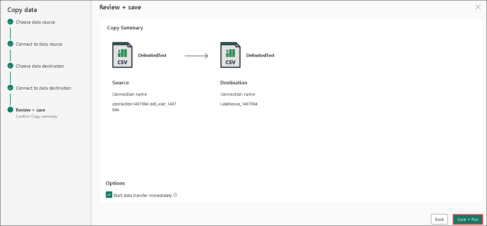

    >**Note:** A new pipeline containing a **Copy data** activity is created, as shown here:

    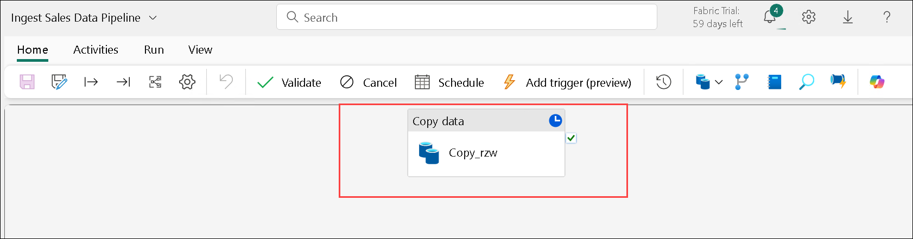

1. When the pipeline starts to run, you can monitor its status in the **Output** pane under the pipeline designer. Use the **&#8635;** (*Refresh*) icon to refresh the status, and wait until it has succeeded.

    

1. In the menu bar on the left, select your lakehouse i.e., **Lakehouse_<inject key="DeploymentID" enableCopy="false"/>**.

    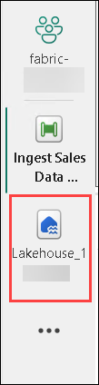

1. On the **Home** page, in the **Lakehouse_<inject key="DeploymentID" enableCopy="false"/> (1)** pane, expand **Files** and select the **new_data (2)** folder to verify that the **sales.csv (3)** file has been copied.

    

   >**Note:** If you are unable to see the **sales.csv** file under **Files**, right-click on **Files** and select **Refresh**.

### Task 4: Create a notebook

1. On the **Home** page for your lakehouse, in the **Open notebook (1)** menu, select **New notebook (2)**.

      

    >**Note:** After a few seconds, a new notebook containing a single *cell* will open. Notebooks are made up of one or more cells that can contain *code* or *markdown* (formatted text).

1. Select the existing cell in the notebook, which contains some simple code, and then replace the default code with the following variable declaration and click on **&#9655; Run**.

    ```python
   table_name = "sales"
    ```

    

1. If a pop-up titled **New data sources and languages now available** appears, please click on **Skip tour** to proceed.  

     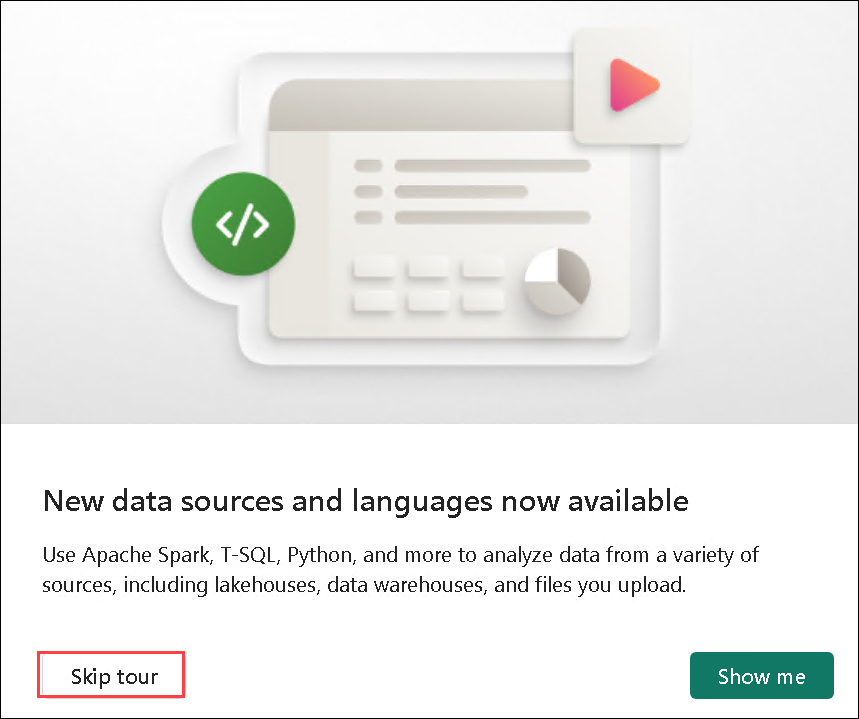

1. In the **... (1)** menu for the cell (at its top-right) select **Toggle parameter cell (2)**. This configures the cell so that the variables declared in it are treated as parameters when running the notebook from a pipeline.

     

1. Under the parameters cell, use the **+ Code** button to add a new code cell. Then add the following code to it:

    ```python
   from pyspark.sql.functions import *

   # Read the new sales data
   df = spark.read.format("csv").option("header","true").option("inferSchema","true").load("Files/new_data/*.csv")

   ## Add month and year columns
   df = df.withColumn("Year", year(col("OrderDate"))).withColumn("Month", month(col("OrderDate")))

   # Derive FirstName and LastName columns
   df = df.withColumn("FirstName", split(col("CustomerName"), " ").getItem(0)).withColumn("LastName", split(col("CustomerName"), " ").getItem(1))

   # Filter and reorder columns
   df = df["SalesOrderNumber", "SalesOrderLineNumber", "OrderDate", "Year", "Month", "FirstName", "LastName", "EmailAddress", "Item", "Quantity", "UnitPrice", "TaxAmount"]

   # Load the data into a managed table
   #Managed tables are tables for which both the schema metadata and the data files are managed by Fabric. The data files for the table are created in the Tables folder.
   df.write.format("delta").mode("append").saveAsTable(table_name)
    ```

   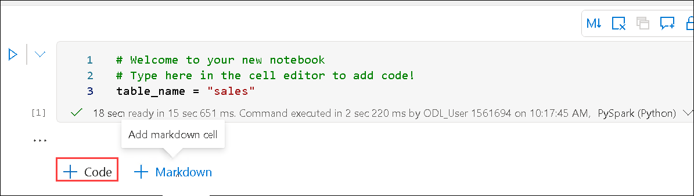 
    
    >**Note:** This code loads the data from the sales.csv file that was ingested by the **Copy Data** activity, applies some transformation logic, and saves the transformed data as a **managed table** - appending the data if the table already exists.

1. Verify that your notebooks look similar to this, and then use the **&#9655; Run all** button on the toolbar to run all of the cells it contains.

    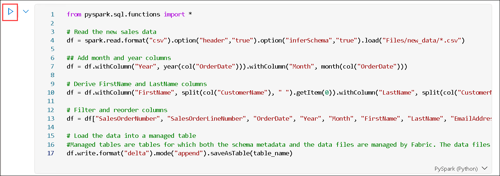

    > **Note**: Since this is the first time you've run any Spark code in this session, the Spark pool must be started. This means that the first cell can take a minute or so to complete.

1. (Optional) You can also create **external tables** for which the schema metadata is defined in the metastore for the lakehouse, but the data files are stored in an external location.

    ```python
    df.write.format("delta").saveAsTable("external_sales", path="<abfs_path>/external_sales")

    #In the Lakehouse explorer pane, in the ... menu for the Files folder, select Copy ABFS path.

    #The ABFS path is the fully qualified path to the Files folder in the OneLake storage for your lakehouse - similar to this:

    #abfss://workspace@tenant-onelake.dfs.fabric.microsoft.com/lakehousename.Lakehouse/Files
    ```
    > **Note**: No need to run. To run the above code, you need to replace the <abfs_path> with your abfs path

1. When the notebook run has completed, in the **Explorer** pane on the left, expand **Lakehouse**.

   

1. In the **Lakehouse_<inject key="DeploymentID" enableCopy="false"/> (1)** pane, expand **Tables (1)**, then select **Refresh** and verify that a **sales (2)** table has been created.

   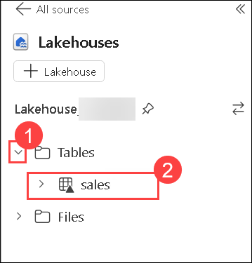

1. Then set the **Name** of the notebook to **Load Sales Notebook (2)** by clicking on the **Saved (1)** drop down from the top left corner.

   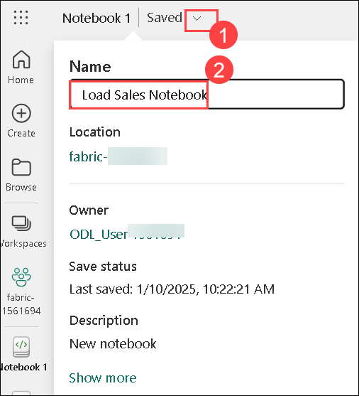
 
1. In the hub menu bar on the left, select your lakehouse **Lakehouse_<inject key="DeploymentID" enableCopy="false"/> (1)**. In the **Explorer** pane, refresh the view. Then expand **Tables (2)**, and select the **sales (3)** table to see a preview of the data it contains **(4)**.

   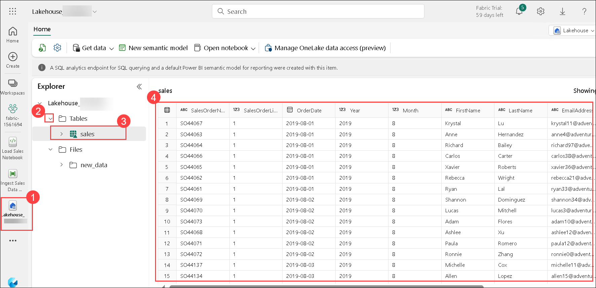

### Task 5: Use SQL to query tables

When you create a lakehouse and define tables in it, an SQL endpoint is automatically created through which the tables can be queried using SQL `SELECT` statements.

1. At the top-right of the Lakehouse page, switch from **Lakehouse** to **SQL analytics endpoint**. Click on the **Lakehouse (1)** drop down and then select **SQL analytics endpoint (2)**. Then wait a short time until the SQL query endpoint for your lakehouse opens in a visual interface from which you can query its tables, as shown here:

    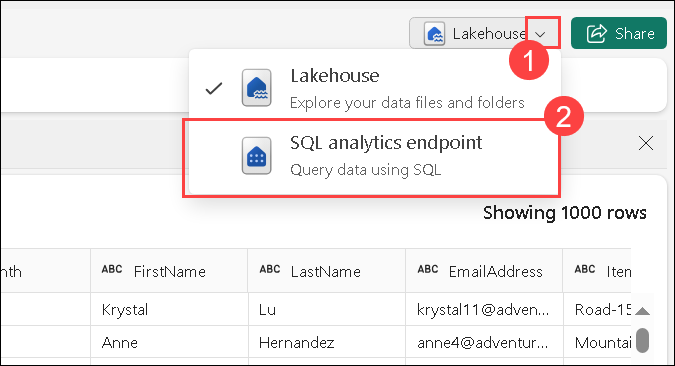

1. Use the **New SQL query (1)** button to open a new query editor, and enter the following SQL query **(2)**:

    ```SQL
   SELECT Item, SUM(Quantity * UnitPrice) AS Revenue
   FROM sales
   GROUP BY Item
   ORDER BY Revenue DESC;
    ```

   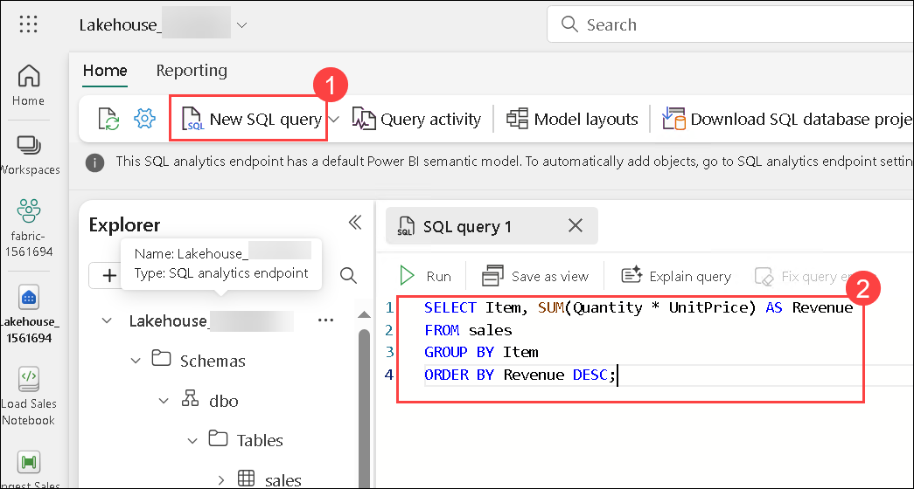

1. Use the **&#9655; Run** button to run the query and view the results, which should show the total revenue for each product.

    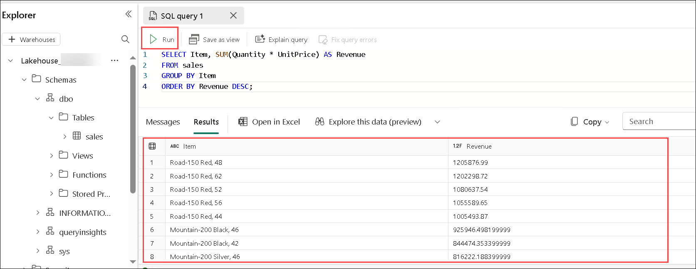

### Task 6: Create a visual query

While many data professionals are familiar with SQL, data analysts with Power BI experience can apply their Power Query skills to create visual queries.

1. On the toolbar, use the **New SQL query (1)** drop-down and select **New visual query (2)**.

    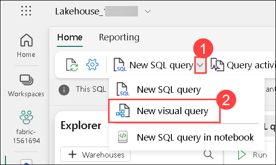

1. Drag the **sales** table to the new visual query editor pane that opens to create a Power Query as shown here: 

    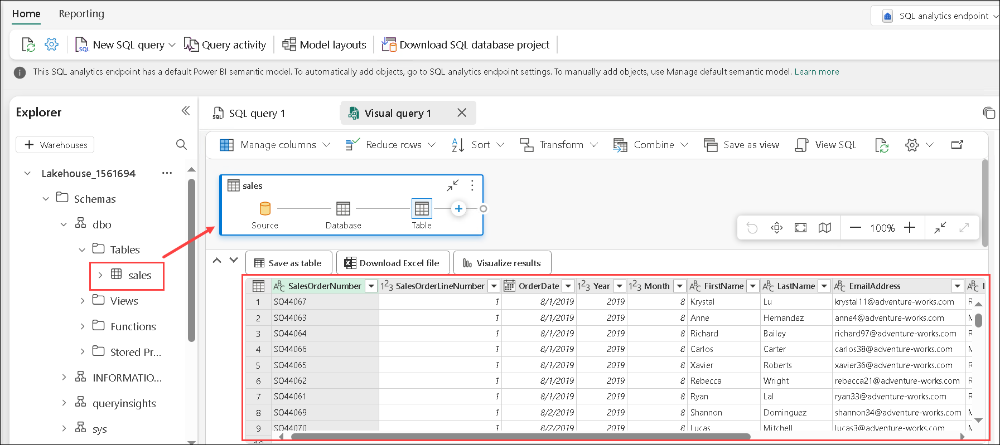

1. In the **Manage columns (1)** menu, select **Choose columns (2)**. Then select only the **SalesOrderNumber** and **SalesOrderLineNumber** **(3)** columns and click on **OK (4)**.

    

    

1. Click on **+ (1)**, in the **Transform table** menu, select **Group by (2)**.

    

1. Then group the data by using the following **Basic** settings and click on **OK (5)**.

    - **Group by**: Select **SalesOrderNumber (1)**
    - **New column name**: Enter **LineItems (2)**
    - **Operation**: Select **Count distinct values (3)**
    - **Column**: Select **SalesOrderLineNumber (4)**

        

1. When you're done, the results pane under the visual query shows the number of line items for each sales order.

    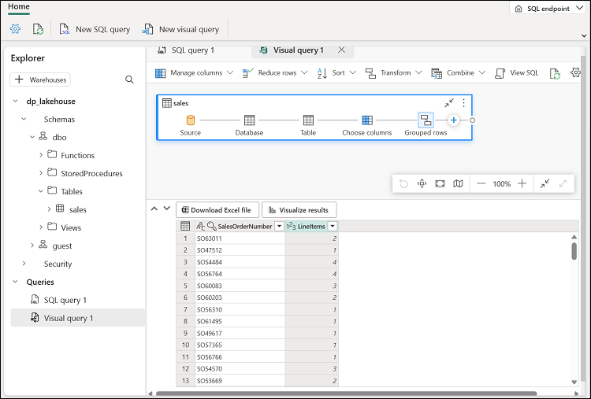

### Task 7: Create a report

The tables in your lakehouse are automatically added to a default dataset that defines a data model for reporting with Power BI.

1. From the left-navigation pane of the SQL Endpoint page, select the **Model layouts** tab. The data model schema for the dataset is shown.

    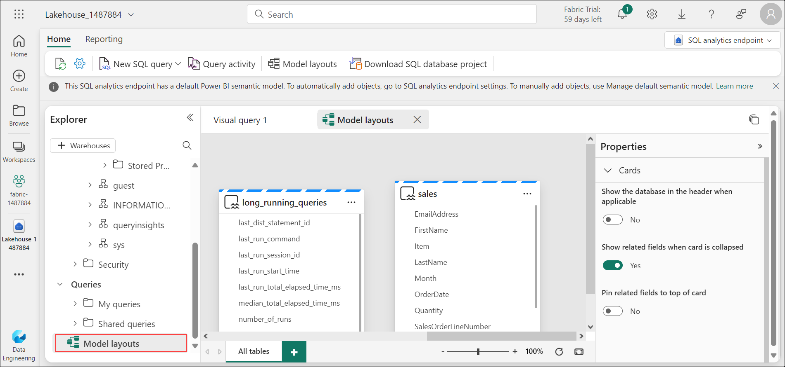

    > **Note**: In this exercise, the data model consists of a single table. In a real-world scenario, you would likely create multiple tables in your lakehouse, each of which would be included in the model. You could then define relationships between these tables in the model.

1. In the menu ribbon, select the **Reporting (1)** tab. Then select **New report (2)**. A new browser tab opens in which you can design your report.

    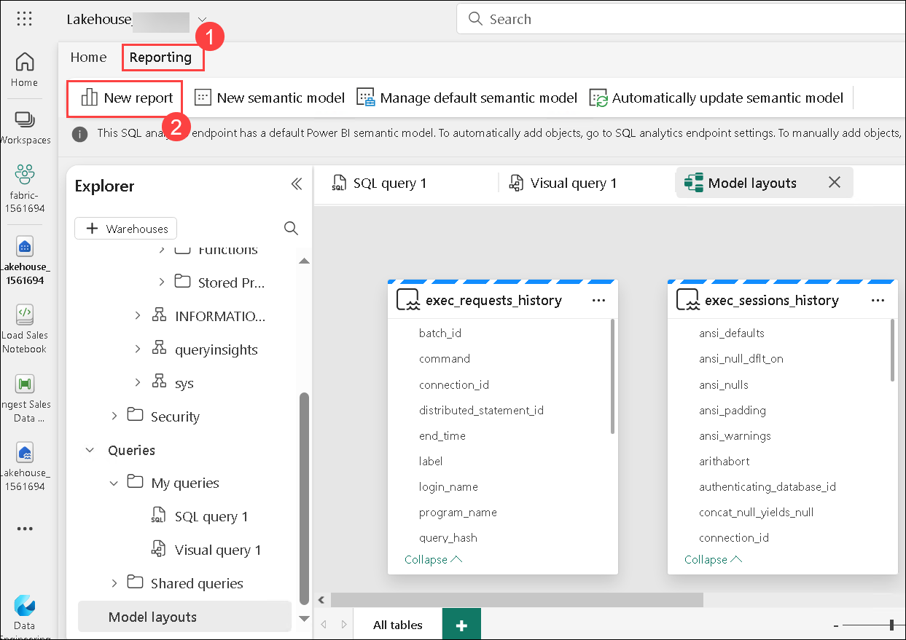

    >**Note:** On the **New report with all available data** select **Continue**.

     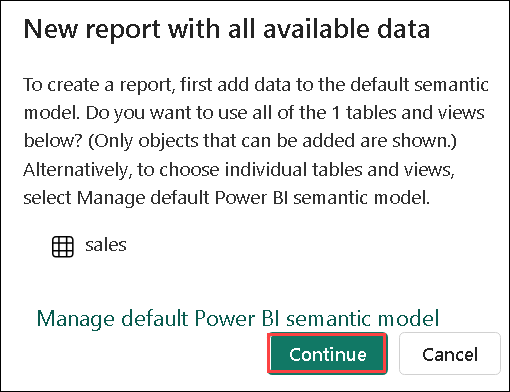    

1. In the **Data (1)** pane on the right, expand the **sales (2)** table. Then select the following fields:
    - **Item (3)**
    - **Quantity (4)**

        >**Note:** A table visualization is added to the report **(5)**:

        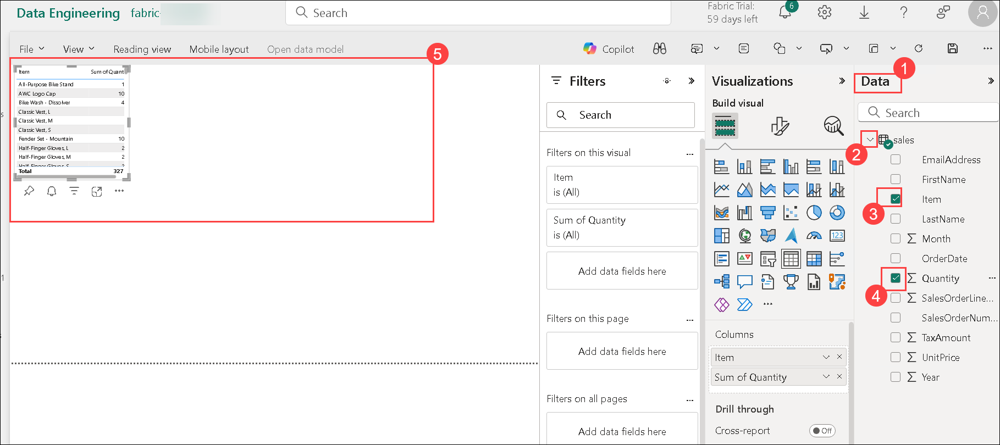

1. Hide the **Data** and **Filters** panes to create more space. Then ensure the table visualization is selected and in the **Visualizations** pane, change the visualization to a **Clustered bar chart** and resize it as shown here.

    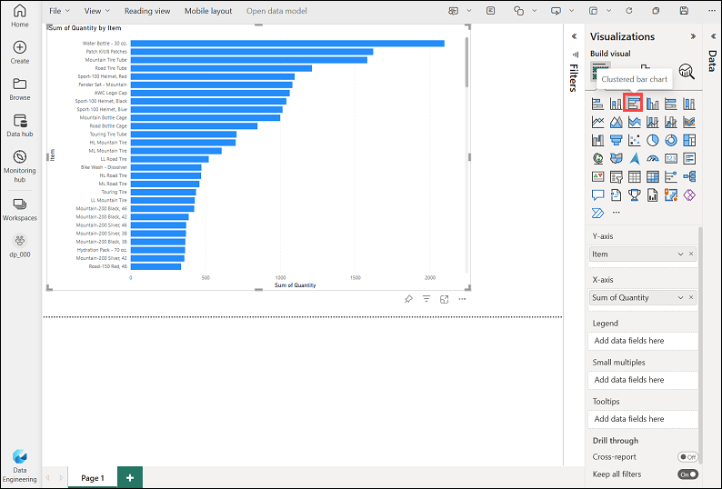

1. On the **File** menu, select **Save**. 

    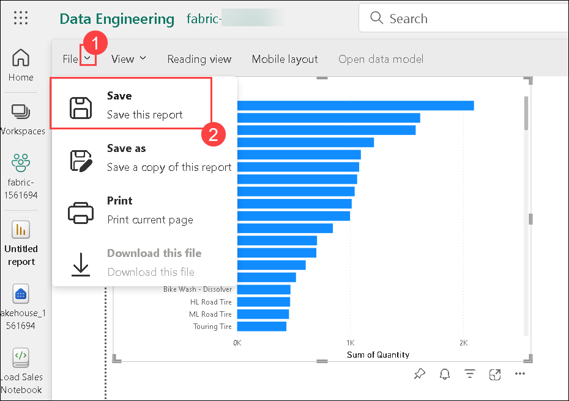

1. Then save the report as **Item Sales Report (1)** in the workspace you created previously and click on **Save (2)** .

    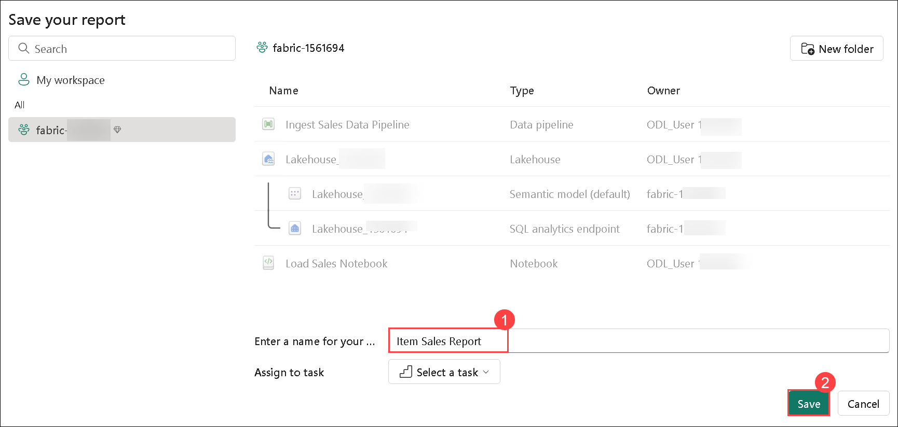

1. Close the browser tab containing the report to return to the SQL endpoint for your lakehouse. Then, in the hub menu bar on the left, select your workspace to verify that it contains the following items:
    - Your lakehouse.
    - The SQL endpoint for your lakehouse.
    - A default dataset for the tables in your lakehouse.
    - The **Item Sales Report** report.

      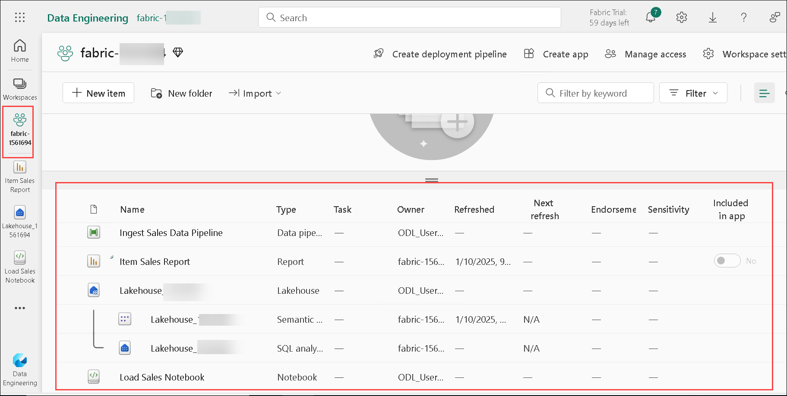    

1. Click on the **Back button** to navigate back to the report page.   

    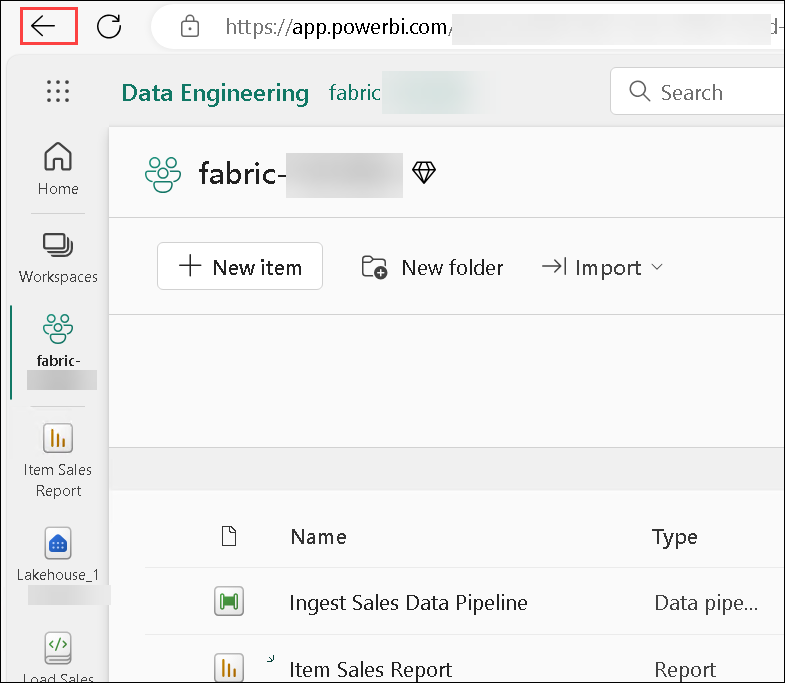

> **Congratulations** on completing the task! Now, it's time to validate it. Here are the steps:

   - Hit the Validate button for the corresponding task. If you receive a success message, you can proceed to the next task. 
   - If not, carefully read the error message and retry the step, following the instructions in the lab guide.
   - If you need any assistance, please contact us at cloudlabs-support@spektrasystems.com. We are available 24/7 to help you out.

<validation step="d21cafee-3ca1-4848-b6d2-04c021e4fce3" />

### Task 8: Analyze report using Fabric Copilot

1. Click on **Copilot (1)** button at the right of the screen to open the copilot chat window, and select **Get Started (2)**.

   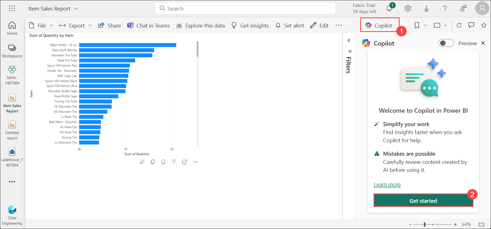

1. Select the first input to copilot as **Give me an executive summary**.

    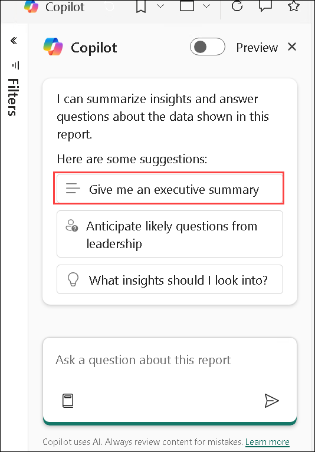

1. Ask copilot **Split the Item column on the ' ', creating three new fields called Description, Color and Size** or **Publish the Report** and analyze the output. 

   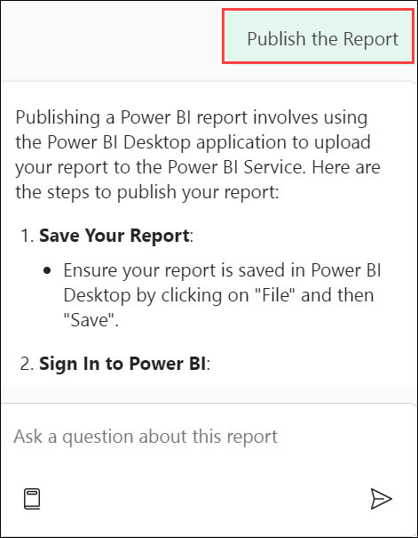

1. After a few seconds, ask diffrent question to copilot **provide me insights of sales on Mountain-200, Silver 46** and read the output to understand the data gathered by copilot.

   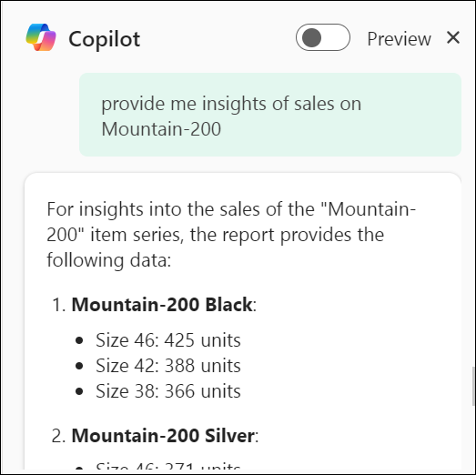

1. Provide another prompt to copilot **what all insights will be valuable from the data we have to double the products sales** and wait for the result. it sometimes take 2 to 5 min.

    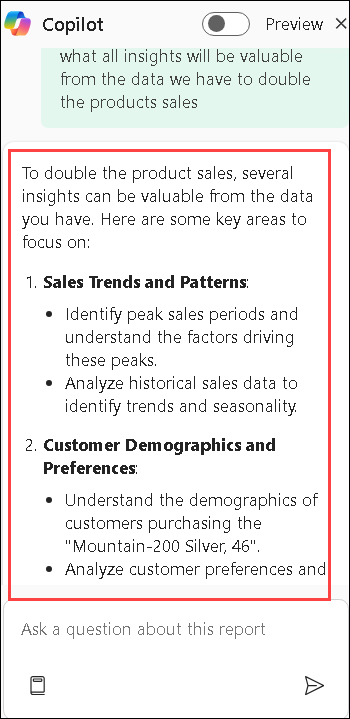

1. Once you receive output from the above prompt, read the output and provide another input to copilot **for all the products**. it will provide potential insights and enhancement for the products sale. 

   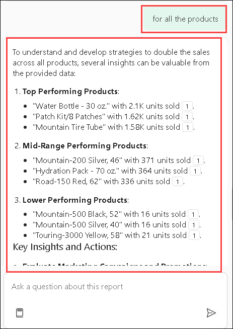

1. You can also try different input prompts to analyze the data more efficiently with the help of copilot.

1. Click on **X** to quit Data Engineering.

   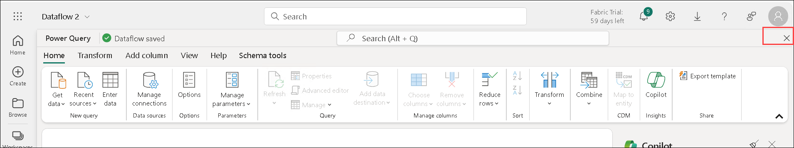

    >**Note:** If the **Are you sure you want to exit** pop-up appears, click on **Yes**.  


### Summary

In this exercise, you have created a lakehouse and imported data into it. You've seen how a lakehouse consists of files and tables stored in a OneLake data store. The managed tables can be queried using SQL, and are included in a default dataset to support data visualizations.

### Review

In this lab, you have completed:

 + Task 1: Create a Lakehouse
 + Task 2: Explore shortcuts
 + Task 3: Create a pipeline
 + Task 4: Create a notebook
 + Task 5: Use SQL to query tables
 + Task 6: Create a visual query
 + Task 7: Create a report
 + Task 8: Analyze report using Fabric Copilot

### You have successfully completed the lab. Click on **Next >>** to procced with next exercise.
