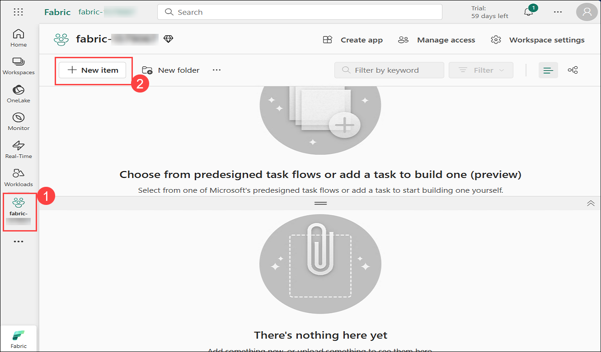
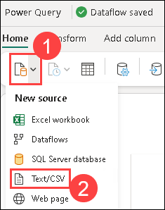
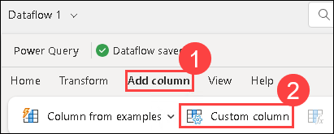
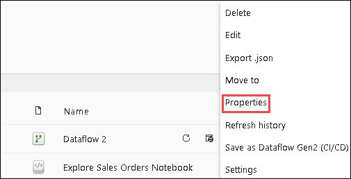
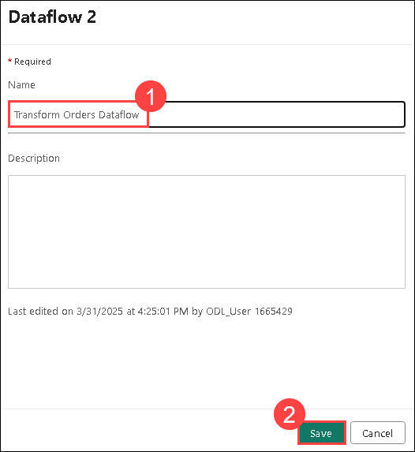
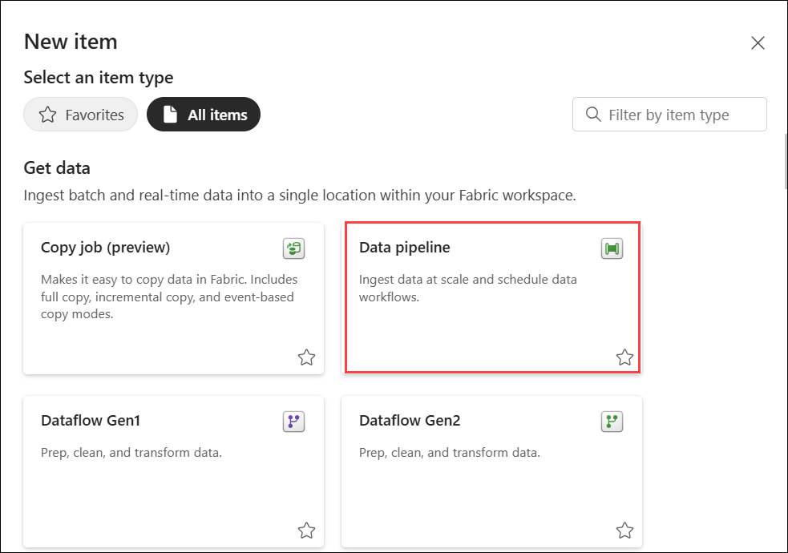

# Exercise 2: Create a Dataflow (Gen2) in Microsoft Fabric

### Estimated Duration: 30 minutes

In Microsoft Fabric, Dataflows (Gen2) connect to various data sources and perform transformations in Power Query Online. They can then be used in Data Pipelines to ingest data into a lakehouse or other analytical store or to define a dataset for a Power BI report.

This lab is designed to introduce the different elements of Dataflows (Gen2), and not create a complex solution that may exist in an enterprise.

## Lab objectives

You will be able to complete the following tasks:

- Task 1: Create a Dataflow (Gen2) to ingest data
- Task 2: Add data destination for Dataflow
- Task 3: Add a dataflow to a pipeline

### Task 1: Create a Dataflow (Gen2) to ingest data

In this task, you will create a Dataflow (Gen2) to efficiently ingest and transform data from multiple sources for analysis. This process streamlines data preparation, enabling you to prepare the data for further processing and insights.

1. Click on **fabric-<inject key="DeploymentID" enableCopy="false"/> (1)** workspace from the left navigation pane and click on **+ New item (2)** to create a Dataflow.

    

1. Search for **Dataflow Gen2** and select it from the list.

1. Select **Get data (1)** and click on **test/csv (2)**.

    

1. Add the following and click on **Next**:

    - **Link to file**: *Selected*
    - **File path or URL**: `https://raw.githubusercontent.com/MicrosoftLearning/dp-data/main/orders.csv`
    - **Connection**: Create new connection
    - **data gateway**: (none)
    - **Authentication kind**: Anonymous
    - **Privacy level**: None

1. Click on **Create** to create the data source. The Power Query editor shows the data source and an initial set of query steps to format the data, as shown below:

   

1. Click on the **Add column (1)** tab from the toolbar ribbon. Then, choose **Custom column (2)**.

    

1. On the dialpog box, provide the name of the New Coloumn as **MonthNo (1)**, the formula as `Date.Month([OrderDate])` **(2)** and click on **OK (3)**.

1. The step to add the custom column is added to the query and the resulting column is displayed in the data pane:

   

### Task 2: Add data destination for Dataflow

In this task, you’ll add a data destination for the Dataflow to determine where the ingested and transformed data will be stored for future use.

1. From the bottom right corner, choose **Lakehouse** from the **Add data destination** drop-down menu.

   

   >**Note:** If this option is greyed out, you may already have a data destination set. Check the data destination at the bottom of the Query settings pane on the right side of the Power Query editor. If a destination is already set, you can change it using the gear.

2. In the **Connect to data destination** dialog box, keep everything as default and click on **Next**.

   

4. Select the **fabric-<inject key="DeploymentID" enableCopy="false"/>** dropdow and choose the **lakehouse**, table named **orders** automatically shows up. Click on **Next**.

   

5. On the Destination settings page, observe that **MonthNo** is not selected in the Column mapping, and an informational message is displayed.
 
6. On the Destination settings page, toggle off the **Use Automatic Settings** option. Then, right-click on the **MonthNo** column header and select **Change Type** to set **MonthNo** as a **Whole number**. Finally, click on **Save Settings**.
    

5. Select **Publish** to publish the dataflow from the bottom right.

    

6. Once published, click on the **ellipsis** next to the published dataflow in the workspace, select **Properties**, rename the dataflow as **Transform Orders Dataflow (1)** and click on **save (2)**.

    

    

### Task 3: Add a dataflow to a pipeline

In this task, you’ll add a dataflow to a pipeline to streamline the data processing workflow and enable automated data transformations.

1. Navigate back to the workspace, click on **+ New item** and select **Data pipeline**.Name the pipeline as **Load Orders pipeline**. This will open the pipeline editor.

    
  
   > **Note**: If the Copy Data wizard opens automatically, close it!

2. Provide the name of the pipeline as **pipeline<inject key="DeploymentID" enableCopy="false"/>** and click on **Create**.

3. Select **pipeline activity (1)** and add a **Dataflow (2)** activity to the pipeline.

   

4. With the new **Dataflow1** activity selected, go to the **Settings (1)** tab in the bottom. In the **Workspace** drop-down list, choose **fabric-<inject key="DeploymentID" enableCopy="false"/>**  **(2)** and for the Dataflow, select **Transform Orders Dataflow (3)** from the dropdown.

   
   
6. **Save** the pipeline from the top left corner.

7. Use the **Run** button to run the pipeline, and wait for it to complete. It may take a few minutes. Verify the run from the Ouput option in the bottom.

   

8. In the menu bar on the left edge, select **fabric_lakehouse<inject key="DeploymentID" enableCopy="false"/>**

9. Expand the **Tables** section and select the **orders** table created by your dataflow.

   

   >**Note:** You might have to refresh the browser to get the expected output.

### Summary

In this exercise, you have created a Dataflow (Gen2) to ingest data , added data destination for Dataflow and a dataflow to a pipeline.

### You have successfully completed the lab.
