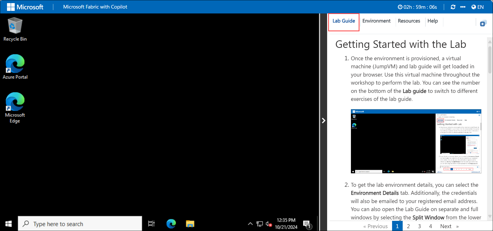

# Getting Started with Lab
 
Welcome to your Microsoft Fabric with Copilot Workshop! A unified data platform designed to simplify data management, analytics, and AI integration. Powered by Copilot, it allows users to effortlessly create, analyze, and visualize data through natural language commands, enhancing productivity and collaboration. With features that span data engineering, real-time analytics, and machine learning, Microsoft Fabric helps streamline workflows and provides a seamless experience for data professionals and business users alike. Let's begin by making the most of this experience:
 
## Accessing Your Lab Environment
 
1. Once you're ready to dive in, your virtual machine and lab guide will be right at your fingertips within your web browser.

     

 ### Virtual Machine & Lab Guide
 
   Your virtual machine is your workhorse throughout the workshop. The lab guide is your roadmap to success.
 
## Exploring Your Lab Resources
 
1. To get a better understanding of your lab resources and credentials, navigate to the **Environment** details tab.

 
   
 
## Utilizing the Split Window Feature
 
1. For convenience, you can open the lab guide in a separate window by selecting the **Split Window** button from the Top right corner.

   
 
## Managing Your Virtual Machine

1. Feel free to **start, stop, or restart (2)** your virtual machine as needed from the **Resources (1)** tab. Your experience is in your hands!

   

## Lab Validation

1. After completing the task, hit the **Validate** button under Validation tab integrated within your lab guide. If you receive a success message, you can proceed to the next task, if not, carefully read the error message and retry the step, following the instructions in the lab guide.

   

1. You can also validate the task by navigating to the **Lab Validation** tab, from the upper right corner in the lab guide section.

   

## **Lab Duration Extension**

1. To extend the duration of the lab, kindly click the **Hourglass** icon in the top right corner of the lab environment. 

   

    >**Note:** You will get the **Hourglass** icon when 10 minutes are remaining in the lab.

2. Click **OK** to extend your lab duration.
 
    

3. If you have not extended the duration prior to when the lab is about to end, a pop-up will appear, giving you the option to extend. Click **OK** to proceed. 

## Let's Get Started with Azure Portal

1. On your virtual machine, click on the Azure Portal icon as shown below:

   
   
1. You'll see the **Sign into Microsoft Azure** tab. Here, enter your credentials:
 
   - **Email/Username:** <inject key="AzureAdUserEmail"></inject>
 
       
 
1. Next, provide your password:
 
   - **Password:** <inject key="AzureAdUserPassword"></inject>
 
       

1. If **Action required** pop-up window appears, click on **Ask later**.

   
    
1. If prompted to stay signed in, you can click **"No"**.
 
1. If a **Welcome to Microsoft Azure** pop-up window appears, simply click **"Cancel"** to skip the tour.

1. Click **"Next"** from the bottom right corner to embark on your Lab journey!

   

This hands-on-lab will help you to gain insights on how Azure OpenAI’s content filtering mechanisms contribute to responsible AI deployment, and how you can leverage these filters to ensure that your AI models adhere to appropriate content standards.

## **Support Contact**

1. The CloudLabs support team is available 24/7, 365 days a year, via email and live chat to ensure seamless assistance at any time. We offer dedicated support channels tailored specifically for both learners and instructors, ensuring that all your needs are promptly and efficiently addressed.

   Learner Support Contacts:

    - Email Support: cloudlabs-support@spektrasystems.com
    - Live Chat Support: https://cloudlabs.ai/labs-support

2. Click **"Next"** from the bottom right corner to embark on your Lab journey!
 
### Now you're all set to explore the powerful world of technology. Feel free to reach out if you have any questions along the way. Enjoy your workshop!
