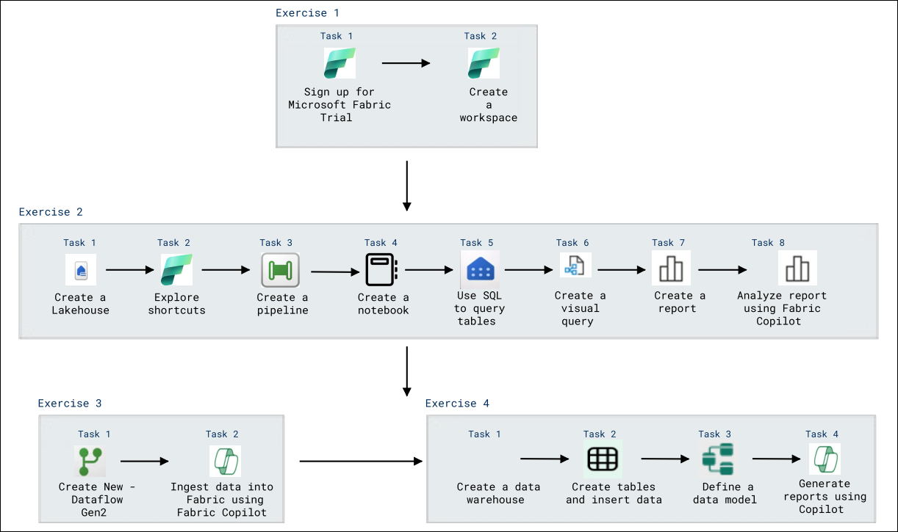
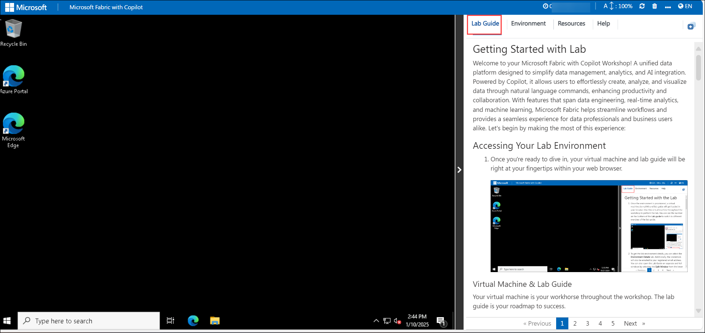
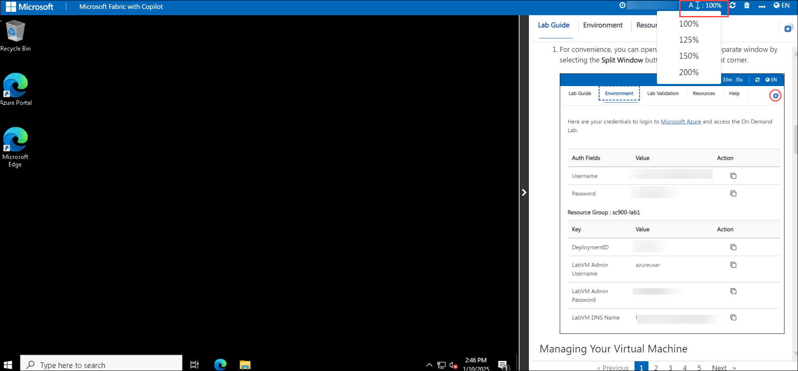
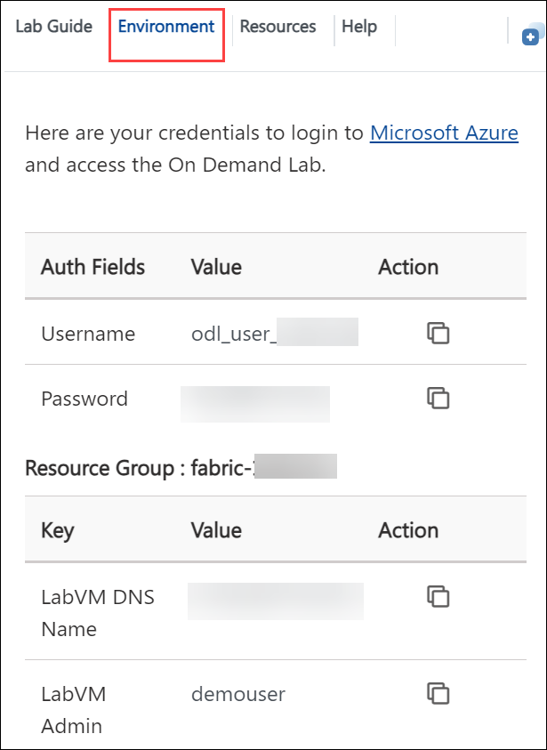
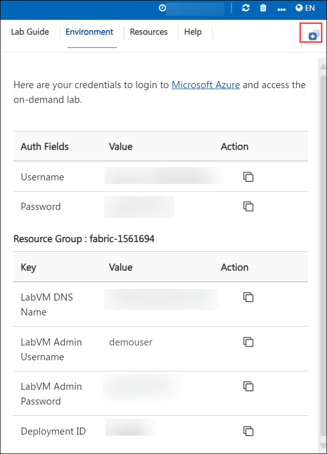
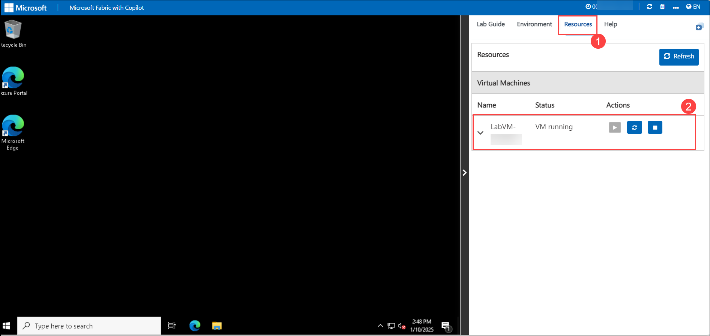
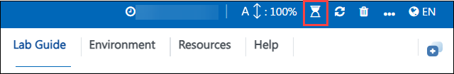
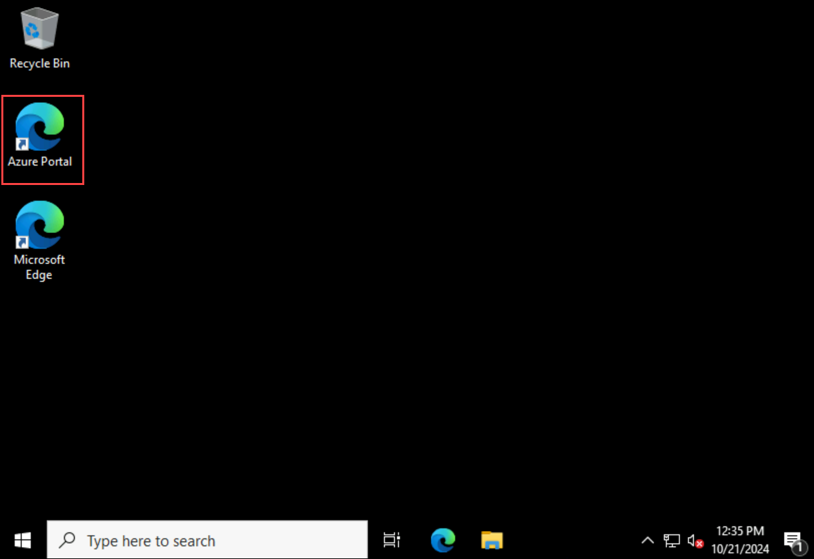

# Microsoft Fabric with Copilot

### Overall Estimated Duration: 4 hours

## Overview

In this hands-on lab, you will establish a Microsoft Fabric workspace to explore its comprehensive data integration, analytics, and visualization tools. You'll ingest data into a Lakehouse using pipelines and Apache Spark, facilitating efficient data processing and transformation. Leveraging Fabric Copilot, you'll create dataflows with natural language inputs, streamlining data ingestion and transformation processes. Additionally, you'll analyze data within a warehouse, utilizing Copilot to generate SQL queries and insightful reports, thereby enhancing decision-making capabilities. 

## Objective

This lab is designed to provide participants with practical experience in utilizing Microsoft Fabric and its Copilot feature to create workspaces, ingest and transform data, and analyze data within a warehouse.

- **Create a Fabric workspace**: Sign up for the Microsoft Fabric Trial and set up a workspace to explore data integration, analytics, and visualization tools..
- **Ingest data with a pipeline in Microsoft Fabric**: Implement ETL/ELT solutions using pipelines and Apache Spark to load and transform data into a Lakehouse for analysis.
- **Data Engineering - Ingest Data in Fabric with Fabric Copilot**: Utilize Fabric Copilot and Dataflow Gen2 to create a data pipeline, leveraging natural language for data ingestion and transformation.
- **Data Warehouse - Analyze Data in a Warehouse with Fabric Copilot**: Analyze data in a warehouse by connecting to data sources, running queries, and visualizing insights using Fabric Copilot to enhance decision-making.

## Prerequisites

Participants should have the following prerequisites:

- **Basic understanding of data management and analytics**: Familiarity with data concepts and terminology will aid in navigating Microsoft Fabric's features.
- **Familiarity with Microsoft 365 tools**: Experience with common Microsoft 365 applications, such as Excel and Power BI, will be beneficial.
- **Azure subscription with appropriate permissions**: Access to an Azure account with the necessary permissions to create and manage resources within Microsoft Fabric is required.
- **Access to Microsoft Fabric**: Participants should have access to Microsoft Fabric with Copilot enabled to perform the exercises.
- **Knowledge of SQL and data visualization**: Understanding SQL queries and data visualization techniques will assist in executing the lab tasks effectively.

## Architechture

The architecture for the **Microsoft Fabric with Copilot** lab enables end-to-end data integration, analytics, and visualization workflows using Fabric's advanced tools and AI capabilities. It begins with creating a dedicated **workspace** to manage resources and collaborate effectively. **Data ingestion** is facilitated through **pipelines** and **Spark-powered** notebooks, storing data in a **Lakehouse** for analysis. Structured data is processed in a **data warehouse**, where **tables** and **data models** are created for efficient querying and reporting. **Fabric Copilot** enhances automation by enabling natural language interactions for data ingestion, transformation, and report generation. This streamlined architecture provides scalability, productivity, and actionable insights, supporting complex data engineering and analytics scenarios.

## Architechture Diagram

## Explanation of Components

The architecture for this lab involves several key components:

- **Microsoft Fabric**: A comprehensive data analytics platform that integrates tools for data engineering, analytics, and visualization, including AI-powered capabilities like Fabric Copilot.

- **Workspace**: A collaborative environment within Microsoft Fabric where resources, projects, and tools are managed, enabling efficient organization and teamwork.

- **Lakehouse**: A unified data storage architecture combining the benefits of data lakes and data warehouses, optimized for both raw and structured data.  

- **Pipeline**: A sequence of data processing steps used to implement ETL (Extract, Transform, Load) or ELT (Extract, Load, Transform) workflows to move and process data.  

- **Notebook**: An interactive tool in Fabric that allows users to write and execute Apache Spark code for data analysis and transformation at scale.  

- **SQL**: A programming language used to query, manipulate, and analyze data stored in tables within the Lakehouse or other data stores.  

- **Visual Query**: A graphical interface that enables users to design and execute data queries without writing code, making data exploration more accessible.

- **Report**: A structured presentation of data insights, often with visualizations like charts and graphs, created for stakeholders to analyze results.

- **Fabric Copilot**: An AI-driven assistant in Microsoft Fabric that helps automate tasks such as data ingestion, transformation, and reporting using natural language commands.

- **Dataflow Gen2**: A modernized data pipeline tool in Fabric that enables the creation of scalable and automated workflows for ingesting and transforming data.

- **Data Warehouse**: A centralized, structured repository optimized for querying and reporting, used for storing processed data ready for analysis.

- **Table**: A structured arrangement of data in rows and columns, used to organize and store information in databases or warehouses.  

- **Data Model**: A structured representation of data and its relationships, designed to enhance analytical queries and reporting efficiency.  

# Getting Started with Lab
 
Welcome to your Microsoft Fabric with Copilot Workshop! A unified data platform designed to simplify data management, analytics, and AI integration. Powered by Copilot, it allows users to effortlessly create, analyze, and visualize data through natural language commands, enhancing productivity and collaboration. With features that span data engineering, real-time analytics, and machine learning, Microsoft Fabric helps streamline workflows and provides a seamless experience for data professionals and business users alike. Let's begin by making the most of this experience:
 
## Accessing Your Lab Environment
 
Once you're ready to dive in, your virtual machine and **Lab guide** will be right at your fingertips within your web browser.

     

## Utilizing the Zoom In/Out Feature

To adjust the zoom level for the environment page, click the **A↕ : 100%** icon located next to the timer in the lab environment. 

     

 ### Virtual Machine & Lab Guide
 
   Your virtual machine is your workhorse throughout the workshop. The lab guide is your roadmap to success.
 
## Exploring Your Lab Resources
 
1. To get a better understanding of your lab resources and credentials, navigate to the **Environment** details tab.
 
   
 
## Utilizing the Split Window Feature
 
1. For convenience, you can open the lab guide in a separate window by selecting the **Split Window** button from the Top right corner.

   
 
## Managing Your Virtual Machine

1. Feel free to **start, stop, or restart (2)** your virtual machine as needed from the **Resources (1)** tab. Your experience is in your hands!

   

## Lab Validation

1. After completing the task, hit the **Validate** button under Validation tab integrated within your lab guide. If you receive a success message, you can proceed to the next task, if not, carefully read the error message and retry the step, following the instructions in the lab guide.

   

## **Lab Duration Extension**

1. To extend the duration of the lab, kindly click the **Hourglass** icon in the top right corner of the lab environment. 

   

    >**Note:** You will get the **Hourglass** icon when 10 minutes are remaining in the lab.

1. Click **OK** to extend your lab duration.
 
    

1. If you have not extended the duration prior to when the lab is about to end, a pop-up will appear, giving you the option to extend. Click **OK** to proceed. 

## Let's Get Started with Azure Portal

1. On your virtual machine, click on the Azure Portal icon as shown below:

   
   
1. You'll see the **Sign into Microsoft Azure** tab. Here, enter your credentials:
 
   - **Email/Username:** <inject key="AzureAdUserEmail"></inject>
 
       
 
1. Next, provide your password:
 
   - **Password:** <inject key="AzureAdUserPassword"></inject>
 
       

1. If **Action required** pop-up window appears, click on **Ask later**.

   
    
1. If prompted to stay signed in, you can click **"No"**.
 
1. If a **Welcome to Microsoft Azure** pop-up window appears, simply click **"Cancel"** to skip the tour.

This hands-on-lab will help you to gain insights on how Azure OpenAI’s content filtering mechanisms contribute to responsible AI deployment, and how you can leverage these filters to ensure that your AI models adhere to appropriate content standards.

## **Support Contact**

1. The CloudLabs support team is available 24/7, 365 days a year, via email and live chat to ensure seamless assistance at any time. We offer dedicated support channels tailored specifically for both learners and instructors, ensuring that all your needs are promptly and efficiently addressed.

   Learner Support Contacts:

    - Email Support: cloudlabs-support@spektrasystems.com
    - Live Chat Support: https://cloudlabs.ai/labs-support

1. Click **Next** from the bottom right corner to embark on your Lab journey!
 
   

### Now you're all set to explore the powerful world of technology. Feel free to reach out if you have any questions along the way. Enjoy your workshop!
